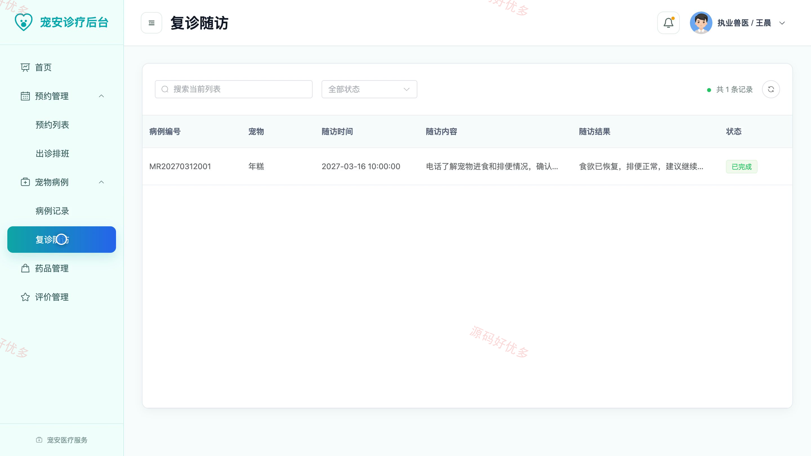
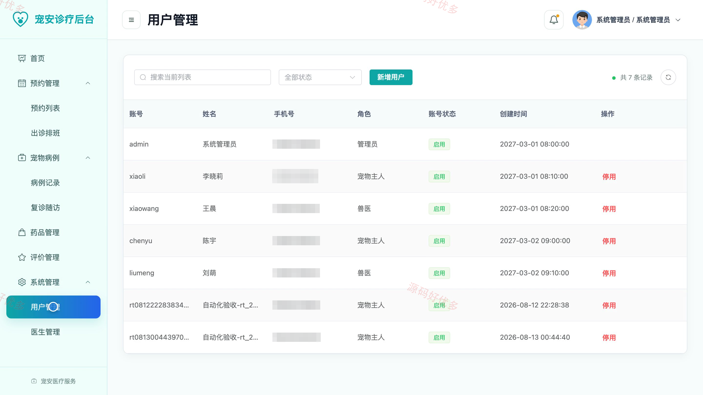
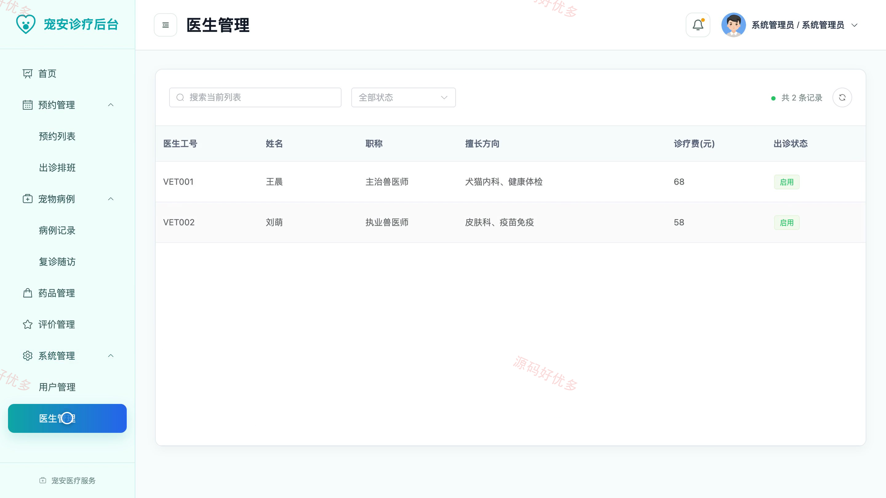

## 源码问题查看主页咨询

### 一、关键词
宠物医院、宠物诊疗、动物医疗、宠物健康、宠物门诊

### 二、作品包含
源码+数据库+全套环境和工具资源+本地部署教程

### 三、项目技术
前端技术： Html、Css、Js、Vue3.4、Element-Plus
后端技术：Java、SpringBoot3.2.0、MyBatis-Plus

### 四、运行环境（以下版本亲测，其他版本兼容性请自行测试）
开发工具：IDEA/eclipse + VSCODE

数据库：MySQL5.7+（共14张表）

数据库管理工具：Navicat10以上版本

环境配置软件： JDK17 + Maven3.6.3

前端Nodejs：20

浏览器：谷歌浏览器

### 五、项目介绍
项目编号：bs043A

宠物医院管理系统面向宠物主人、兽医和管理员，围绕宠物档案、诊疗预约、就诊记录、服务订单、药品与评价等真实业务开展协同管理。

角色：宠物主人、兽医、管理员

宠物主人功能：宠物档案维护、诊疗服务浏览与预约、就诊记录查看、服务订单查看与支付、评价反馈、个人资料维护、密码修改。

兽医功能：运营看板、预约列表与出诊排班、病例记录与复诊随访、药品管理、评价查看与回复、个人资料维护。

管理员功能：运营看板、预约列表与出诊排班、病例记录与复诊随访、药品管理、评价管理、订单管理、用户与医生管理、个人资料维护。

### 六、运行截图

